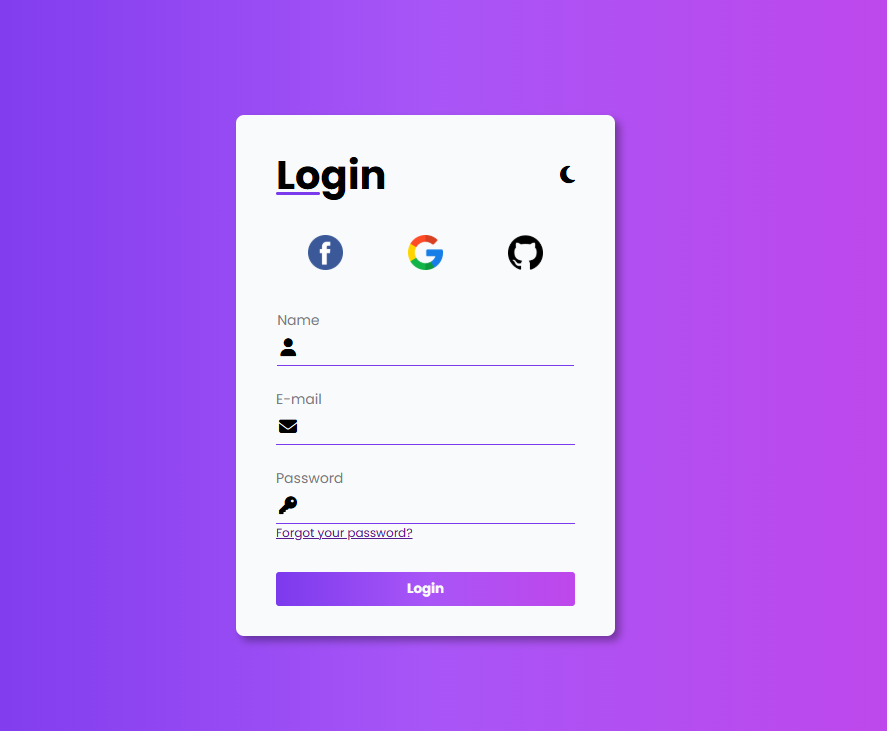
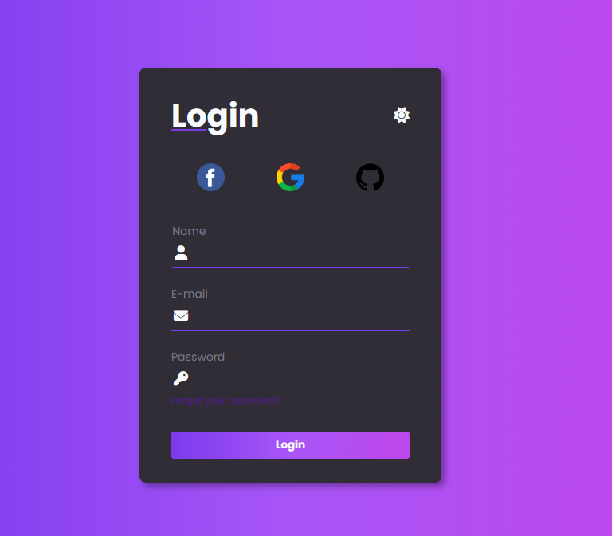

# 📝 Formulário com Modo Dark e Light

Este projeto é um **Formulário de Contato** simples que permite alternar entre os modos **Claro (Light)** e **Escuro (Dark)**.  
Foi desenvolvido utilizando **HTML**, **CSS** e **JavaScript** puro, sem bibliotecas externas.

## 🚀 Funcionalidades

- Formulário com campos básicos:
    - Nome
    - E-mail
    - Password
- Botão para alternar entre o modo **Light** e **Dark**.
- Estilo visual adaptado para cada tema.
- Responsividade: compatível com telas de diferentes tamanhos.
- Alteração dinâmica do tema sem recarregar a página.

## 📁 Estrutura de Arquivos

```
formulario-dark-light/ 
├── index.html # Estrutura do formulário 
├── style.css # Estilos para os modos Light e Dark 
└── script.js # Lógica para alternar os temas
```

## 🛠️ Tecnologias Utilizadas

- HTML5 – Estrutura dos elementos do formulário.
- CSS3 – Estilização para os modos claro e escuro.
- JavaScript – Controle da mudança dinâmica de tema.

## 🎨 Como funciona o modo Dark/Light

- Existe um botão para alternar entre os temas.
- O JavaScript adiciona ou remove uma classe (dark-mode) no elemento body.
- O CSS aplica estilos diferentes dependendo da presença dessa classe.
    - Exemplo de controle no JavaScript:

```
const mode = document.getElementById('mode_icon');

mode.addEventListener('click', () => {
    const form = document.getElementById('login_form');
    if(mode.classList.contains('fa-moon')) {
        mode.classList.remove('fa-moon');
        mode.classList.add('fa-sun');
        form.classList.add('dark');
        return;
    }

    mode.classList.add('fa-moon');
    mode.classList.remove('fa-sun');
    form.classList.remove('dark');
});
```

## 🎨 Paleta de Cores Utilizada

```
:root {
    --color-light-50: #f8fafc;

    --color-dark-50: #797984;
    --color-dark-100: #312d37;
    --color-dark-900: #000;

    --color-purple-50: #7c3aed;
    --color-purple-100: #a855f7;
    --color-purple-200: #bf47eb;

    --color-gradient: linear-gradient(90deg, var(--color-purple-50), var(--color-purple-100), var(--color-purple-200));
}
```

> Essas cores garantem contraste e boa legibilidade em ambos os modos.

## 📸 Captura de Tela

- Modo Light:


- Modo Dark:


## 📸 Prévia do projeto

(https://neginterprises.github.io/Formul-rio-com-modo-dark-e-light/)